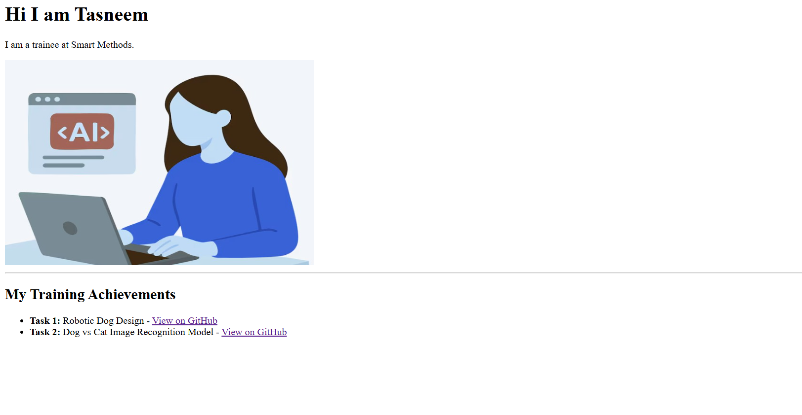

# Basic HTML Web Page Design

This project demonstrates the creation of a fundamental, semantic HTML web page. The page serves as a personal introduction and a showcase of project achievements.

---

## 📸 Final Web Page Preview

<p align="center">
  
</p>

---

## 🛠️ Development & Workflow Steps

The web page was constructed sequentially following standard web development practices and utilizing documentation resources:

### 1. Documentation & References
* **Resource Used:** Official HTML tutorials and element structures from [w3schools.com](https://www.w3schools.com) were referenced to ensure syntactic correctness and proper tag usage.

### 2. Implementation Sequence
* **Step 1: Introduction Headers:** Defined the core heading hierarchy using standard `<h1>` tags for the welcome statement and `<p>` tags for the background description.
* **Step 2: Media Integration:** Embedded the professional illustration image using the `` tag with explicit dimensional attributes to control the visual layout.
* **Step 3: Section Separator:** Implemented an horizontal rule (`<hr>`) to cleanly divide the biography from the portfolio section.
* **Step 4: Achievements & Hyperlinks:** Built an unordered list (`<ul>` and `<li>`) along with anchor tags (`<a>`) to dynamically link previous repositories directly to GitHub.

---

## 💻 Source Code Structure

```html
<!DOCTYPE html>
<html>
<head>
<title>Page Title</title>
</head>
<body>

<h1>Hi I am Tasneem</h1>
<p>I am a trainee at Smart Methods.</p>


<hr>

<h2>My Projects & Achievements</h2>
<ul>
    <li>
        <strong>Robotic Dog Design:</strong> 
        - <a href="[https://github.com/tasneem2003mo/Robotic-dog-design-/tree/main](https://github.com/tasneem2003mo/Robotic-dog-design-/tree/main)" target="_blank">View on GitHub</a>
    </li>
    <li>
        <strong>Dog vs Cat Image Recognition Model:</strong> 
        - <a href="[https://github.com/tasneem2003mo/Image-recognition-model-/tree/main](https://github.com/tasneem2003mo/Image-recognition-model-/tree/main)" target="_blank">View on GitHub</a>
    </li>
</ul>

</body>
</html>
